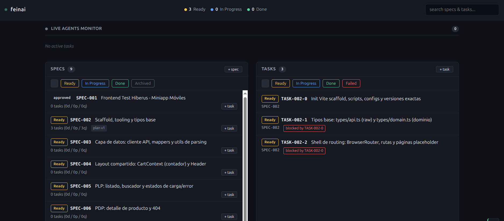
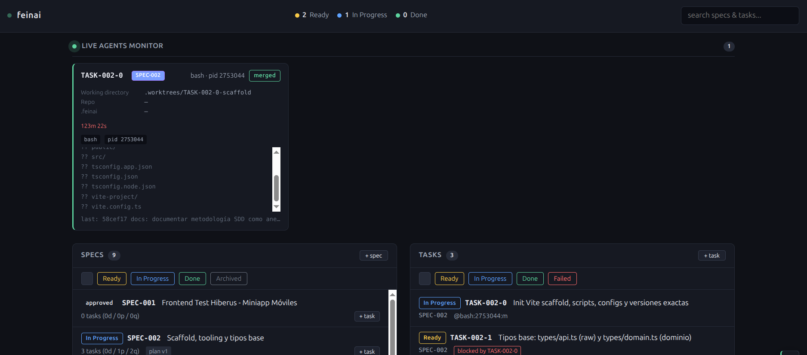
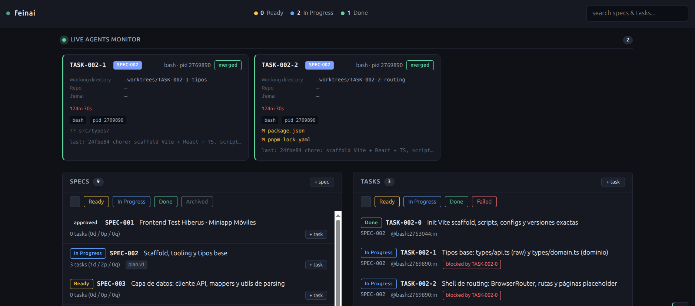

# Contexto del proyecto — Miniapp Móviles

Este documento es la fuente única de verdad del proyecto: decisiones de arquitectura, contrato real del API (verificado contra el backend), convenciones y justificaciones. El enunciado original de la prueba no forma parte de este repositorio por confidencialidad del proceso.

## 1. Qué es este proyecto

SPA de comercio de dispositivos móviles con dos vistas — listado (PLP) y detalle de producto (PDP) —, carrito con contador simple respaldado por el servidor, y caché cliente de las respuestas del API con expiración.

Backend real: `https://itx-frontend-test.onrender.com` (API REST ya provista, no se desarrolla backend).

## 2. Stack tecnológico

| Decisión | Elección |
|---|---|
| Framework | React 19 |
| Lenguaje | TypeScript estricto |
| Bundler | Vite 5 |
| Routing | React Router DOM v6 (Browser Router, sin `#`) |
| Testing | Vitest + React Testing Library |
| Linter | ESLint 10.8.0 (flat config), incluido con el scaffold de Vite + `@vitejs/plugin-react` — versión confirmada por el scaffold instalado; se esperaba una 9.x, pero `create-vite` trae la última major disponible en el momento del scaffold |
| Gestor de paquetes | pnpm (se documenta alternativa con npm en README) |
| Estado global | React Context (solo contador de carrito) |
| Estilos | CSS Modules |
| Identidad visual | Paleta clara "Paper & Ink" (superficies blancas, acento índigo) + tipografía Space Grotesk/Inter/JetBrains Mono, animaciones mínimas — SPEC-010 |
| Colores dinámicos | Mapping a clases CSS completas (`colorMap[code]`), nunca cadenas construidas dinámicamente |
| Validación runtime del API | Funciones defensivas puntuales (`parsePrice`, `toList`) sobre las inconsistencias reales encontradas — ver §4.5 |
| Versionado de dependencias | Versiones exactas en `package.json` (sin `^`/`~`), fijadas también por el lockfile de pnpm. Garantizado por `save-exact=true` en `.npmrc` (raíz del repo, versionado) — válido tanto con `pnpm add` como con `npm install`. Evita que una actualización menor/patch de una dependencia rompa el build sin que medie una decisión explícita de subir versión |

No es SPA con SSR ni MPA: una sola aplicación cliente servida estática tras build.

### Nota sobre el enunciado: "se permite JS con ES6"

El enunciado permite JavaScript (ES6+) como alternativa a TypeScript; no es una directriz de build ni de compatibilidad de navegadores. Se opta por **TypeScript con tipado estricto** (ver tabla de stack) porque documenta el contrato real del API — typos y campos polimórficos incluidos, ver §4.3 — de forma verificable en compile-time.

## 3. Modelo de carrito y sesión

- **Modelo**: solo contador numérico. El carrito nunca almacena la lista de artículos en cliente.
- **Fuente de verdad**: el servidor. El `count` devuelto por `POST /api/cart` es siempre el valor autoritativo.
- **Persistencia cliente**: se guarda únicamente el último `count` conocido en `localStorage` bajo la clave `cartCount`. Es también la única fuente del contador al cargar la app: `GET /api/cart` no existe en el API (verificado — devuelve `404 Cannot GET /api/cart`), así que no hay forma de consultar el contador al servidor sin agregar un producto. El valor de `localStorage` se pinta de entrada y se actualiza con el `count` real recién en el próximo `POST /api/cart`.
- **Autenticación**: cookies `HttpOnly` firmadas por el servidor; el navegador las envía automáticamente con `fetch(..., { credentials: 'include' })`. No se gestiona la sesión desde el cliente.

### Detección de pérdida de sesión (heurística)

Verificado empíricamente: la cookie de sesión no tiene `Max-Age`/`Expires` (se confirmó inspeccionando la respuesta del servidor) — es una cookie de sesión pura, cuya validez depende enteramente del estado en memoria del servidor. Esto es consistente con el comportamiento observado: la sesión se pierde por reinicio/spin-down del servidor (típico del free tier de Render tras inactividad), no por expiración del lado del cliente. Por eso `cartCount` (ver más abajo) se persiste sin TTL propio: no hay nada que expirar del lado cliente, la pérdida siempre la origina el servidor.

- **Función**: `isValidIncrement(prevCount: number, newCount: number): boolean` → `true` cuando `newCount > prevCount` (continuación normal de la sesión); `false` en cualquier otro caso. Cuando devuelve `false`, se interpreta como pérdida de la sesión anterior y se muestra un aviso al usuario ("se perdió el carrito anterior, se inició uno nuevo"). El nuevo `count` se persiste siempre, sea cual sea el resultado.
- **Fuera de alcance**: por qué o cuándo exactamente el backend pierde la sesión — es infraestructura del servidor, no controlable desde el frontend.
- **Límite conocido (aceptado)**: si el carrito está en `0` cuando se pierde la sesión, un nuevo `count: 1` es indistinguible de un incremento normal — `isValidIncrement` da `true` en ambos casos. Resolverlo requeriría que el backend expusiera alguna señal de continuidad de sesión (p. ej. un id de sesión persistente separado del contador), algo fuera del control del frontend. Se acepta esta limitación por esa razón, no por conveniencia.

## 4. Contrato real del API (verificado empíricamente)

El backend no está completamente documentado; lo siguiente se confirmó con pruebas directas (`curl`) contra el entorno en producción.

### 4.1 `POST /api/cart` — validación real

- Valida **presencia estructural** de `id`, `colorCode`, `storageCode`: si falta alguno, devuelve `400` con body `{"message":"Invalid parameters","code":0}` (verificado con `curl` contra el endpoint real).
- **No valida semánticamente** los valores: acepta `id`, `colorCode` o `storageCode` inexistentes, responde `200 OK` e incrementa el contador igualmente.
- Los códigos inválidos **no afectan la sesión** (no la resetean, no dan error, no cambian el comportamiento del contador).
- **Consecuencia de diseño**: la validez de las opciones seleccionadas es responsabilidad exclusiva del frontend. Los selectores de color y almacenamiento en el PDP se populan siempre desde `options.colors[]` / `options.storages[]` de la respuesta del propio producto — nunca se permite un valor fuera de esa lista, evitando así que el usuario pueda enviar un código inválido desde la UI.
- No se puede usar "el contador no incrementó" como señal de opción inválida: el API siempre incrementa, sin importar la validez de los códigos.

### 4.1b `GET /api/product/:id` — 500 indistinguible de "id inexistente"

Verificado empíricamente: navegar a `/product/<id-inválido>` (id editado a mano en la URL, no alcanzable desde la UI normal) no devuelve `404`, devuelve `500` con body genérico `{"message":"An Unexpected Error Occurred","code":0}` — idéntico body y tiempo de respuesta (~0.12s) tanto para ids válidos como inválidos, así que ni el body ni el timing sirven como señal.

- **Heurística**: en `getProductDetail(id)` (`src/api/products.ts`), si el fetch falla con cualquier error que no sea ya un `ApiError` 404, se intenta confirmar la ausencia del id contra `getProducts()` (hit de caché si el listado ya está tibio, red si no). Si el listado se obtiene con éxito y el id **no** está en él, se sintetiza un `ApiError(404, ...)` — la misma clase y shape que ya maneja `ProductDetailPage` para un 404 real, sin nueva clase de error ni cambios en el consumidor.
- Si el id **sí** está en el listado, o si el propio `getProducts()` también falla, no se puede confirmar nada: se repropaga el error original y sigue el mecanismo de backoff/reintento normal de §6 — un 500 real de servidor (cold-start, etc.) no queda enmascarado por la heurística.
- **Límite conocido (aceptado)**: si el listado también falla en el momento del cross-check, "id inválido" y "servidor caído" quedan indistinguibles — se prioriza no perder reintentos legítimos ante un fallo real, a costa de no siempre poder anunciar "producto no encontrado" de inmediato en ese caso límite.

### 4.2 Precio (`price`)

- Viene como `string`. En una muestra de 100 productos del catálogo real, ~6% tenían `price: ""`.
- `parsePrice(raw: string): number | null` — devuelve `null` ante `''` o cualquier string no numérico.
- Si `price` es `null`: el producto se marca como **"No disponible"** tanto en PLP como en PDP (precio oculto, botón de añadir al carrito deshabilitado). No se ocultan productos sin precio, se muestran como no disponibles.
- No se implementa ordenamiento por precio (no lo pide el enunciado).

### 4.3 Detalle de producto — inconsistencias de nombres y tipos

Sobre los campos que **sí** requiere el enunciado:

- **Typos reales del API** (se preservan tal cual en el tipo raw, no se "corrigen" en la fuente): `dimentions` (no `dimensions`), `secondaryCmera` (no `secondaryCamera`).
- **Campos con nombres invertidos**: `displayResolution` en realidad contiene el tamaño físico en pulgadas; `displaySize` en realidad contiene la resolución en píxeles. Verificado en múltiples productos, consistente. El atributo "Resolución de pantalla" del enunciado se mapea desde `displaySize`, no desde `displayResolution`.
- **Campos polimórficos** (`string` en algunos productos, `string[]` en otros, sin patrón aparente): `cpu`, `ram`, `os`, `primaryCamera` y `secondaryCmera` — los cinco requeridos por el enunciado (CPU, RAM, Sistema Operativo, Cámaras). Verificado en muestra real: p. ej. `ram: ["2 GB RAM or 4 GB", "1 GB RAM"]` (Acer Liquid E700), `cpu: ["ST Ericsson PNX6715", "416 MHz"]` (Acer beTouch E120), `os: ["Android 4.4.4 (KitKat)", "upgradable to 5.1 (Lollipop)"]` (Acer Liquid Jade S). Es data scrapeada (aparenta ser de GSMArena) donde el campo original venía como fragmentos separados por comas y quedó partido de forma inconsistente entre elementos del array — no hay estructura semántica que reconstruir. Los cinco campos se normalizan igual, sin lógica especial por campo: `toList(v: string | string[]): string[]` seguido de `.join(', ')`.
- `options.colors[]` / `options.storages[]` llegan consistentes como `{ code: number; name: string }[]` en todos los productos verificados.

Sobre campos que el API expone pero **no** pide el enunciado: se observó que `wlan`, `bluetooth`, `sensors` también son polimórficos (`string` o `string[]`) y que `nfc` aparece siempre como `''` en la muestra verificada. Se documenta la observación como evidencia de la inconsistencia general del backend; el alcance de esta prueba se limita a los campos que el enunciado pide, así que el tipo raw y el mapper cubren únicamente esos.

### 4.4 Tipos

```ts
// Fiel al API, incluye los typos reales. Solo declara los campos que
// efectivamente se leen (el response trae más campos sin usar — ver 4.3).
interface ProductDetailRaw {
  id: string;
  brand: string;
  model: string;
  price: string;
  cpu: string | string[];
  ram: string | string[];
  os: string | string[];
  displaySize: string;       // realmente: resolución en píxeles
  displayResolution: string; // realmente: tamaño físico en pulgadas
  battery: string;
  primaryCamera: string | string[];
  secondaryCmera: string | string[];
  dimentions: string;
  weight: string;
  options: {
    colors: { code: number; name: string }[];
    storages: { code: number; name: string }[];
  };
}

// Tipo de dominio limpio, el único que consume la UI
interface ProductDetail {
  id: string;
  brand: string;
  model: string;
  price: number | null;
  cpu: string;
  ram: string;
  os: string;
  screenResolution: string;
  battery: string;
  rearCamera: string;   // primaryCamera normalizado y unido
  frontCamera: string;  // secondaryCamera normalizado y unido
  dimensions: string;
  weight: string;
  colors: { code: number; name: string }[];
  storages: { code: number; name: string }[];
}
```

`mapProductDetail(raw): ProductDetail` vive junto al fetch, en `api/products.ts`: corrige el swap de resolución/tamaño, normaliza los campos polimórficos (`toList` + `.join(', ')` para `cpu`, `ram`, `os`, `primaryCamera`, `secondaryCmera`) y aplica `parsePrice`.

**Listado** (`GET /api/product`) — shape confirmado por request directa:

```ts
interface ProductListItemRaw {
  id: string;
  brand: string;
  model: string;
  price: string; // mismo problema: puede venir ''
  imgUrl: string;
}

interface Product {
  id: string;
  brand: string;
  model: string;
  price: number | null;
  imgUrl: string;
}
```

`mapProductListItem(raw): Product` aplica `parsePrice`, mismo patrón que el mapper de detalle. Se cachea el array ya mapeado.

### 4.5 Alcance de la validación runtime del API

Las únicas inconsistencias reales encontradas (precio vacío, campos polimórficos) están cubiertas por dos funciones puntuales, `parsePrice` y `toList`, aplicadas en los mappers junto al fetch. El `interface` de TypeScript documenta el contrato en compile-time; la garantía runtime se limita a esos dos casos verificados, por decisión de alcance explícita.

## 5. Caché cliente

- **Método**: `localStorage`, TTL de 1 hora, independiente del estado del carrito.
- **Listado de productos** (`GET /api/product`): se cachea como un único blob `{ data: Product[], timestamp }` bajo una sola clave. El endpoint ya devuelve el array completo en una sola llamada; se cachea ya mapeado (`Product[]`, no el raw).
- **Detalle de producto** (`GET /api/product/:id`): una clave independiente por producto, `product_detail_<id>` → `{ data: ProductDetail, timestamp }`. Motivo: cada detalle se pide y expira de forma independiente; una clave por id evita reescribir/reparsear todo un diccionario en cada visita a un PDP, y aísla la corrupción — un JSON inválido en una entrada no invalida el resto del caché. El volumen (máximo ~100 entradas, catálogo completo) es intrascendente para la cuota de `localStorage`.
- **Carrito**: `cartCount`, un entero, clave separada — sin relación con el TTL de 1 hora del catálogo.

## 6. Contrato de vistas y componentes

### Rutas

| Ruta | Vista |
|---|---|
| `/` | `ProductListPage` (PLP) |
| `/product/:id` | `ProductDetailPage` (PDP) |

**PLP (`ProductListPage`)**: listado con buscador (filtra por marca + modelo en tiempo real, con placeholder "Buscar por marca o modelo" — el label sigue existiendo para lectores de pantalla vía CSS visually-hidden, `htmlFor`/`id` asociados, solo se ocultó visualmente a favor del placeholder) y grilla de `ProductItem` (imagen, marca, modelo, precio o "No disponible"). Si el filtro no matchea ningún producto, la grilla se reemplaza por un estado vacío con el mensaje "No se encontraron resultados para «‹término›»" — no se oculta el buscador ni se resetea el término.

Mientras `GET /api/product` está en curso, se muestra un mensaje simple de "Cargando productos...". Si el primer intento falla (error de red o respuesta no-2xx — relevante por el cold-start del free tier de Render), se reintenta automáticamente en backoff lineal (2, 4, 6, 8, 10 s) con countdown visible y aviso de que el servidor puede estar "dormido"; agotados esos reintentos, se muestra el mensaje de error con un botón para reintentar a mano (SPEC-011).

**Grilla de la PLP**: columnas explícitas por breakpoint (`repeat(2, 1fr)` base, `repeat(3, 1fr)` desde 640px, `repeat(4, 1fr)` desde 960px) en vez de `grid-template-columns: repeat(auto-fill, minmax(...))`. `auto-fill` calcula la cantidad de columnas a partir del ancho disponible de forma no determinística — con pocos resultados de búsqueda terminaba en una sola columna incluso en viewports grandes. Los breakpoints explícitos garantizan el conteo de columnas esperado en cada tamaño de viewport, sin importar cuántos ítems haya.

**Estabilidad del ancho del contenedor** (`.page` en PLP y PDP): ambas tienen `width: 100%` explícito antes de `max-width` y `margin-inline: auto`. Sin el `width: 100%`, un ítem flex con `width: auto` y márgenes automáticos en el eje cruzado no hereda el `align-items: stretch` del contenedor padre (`#root`, `display: flex; flex-direction: column`) — se ajusta al contenido y luego se centra esa caja encogida. Con pocos o cero resultados de búsqueda, esto se traducía en que el buscador y la grilla (o el estado vacío) se contraían de ancho en vez de mantenerse a `max-width` completo. Verificado empíricamente con Playwright (medición de `getBoundingClientRect()` antes/después del fix, con la API mockeada para forzar los estados de "pocos resultados" y "cero resultados").

**PDP (`ProductDetailPage`)**, dividido en tres bloques:
- `ProductImage`: imagen del producto.
- `ProductDescription`: specs — marca, modelo, precio, CPU, RAM, sistema operativo, resolución de pantalla, batería, cámaras (trasera y frontal como líneas separadas), dimensiones, peso. Cada valor pasa por `formatSpecValue` (`src/utils/formatSpecValue.ts`): un valor vacío o solo whitespace se unifica a `"-"` — el API a veces trae `''` y a veces ya trae `"-"` para el mismo tipo de dato faltante, así la ficha nunca mezcla ambos formatos. El texto de los valores se muestra en `0.875rem`, visualmente cercano al `0.7rem` mono en mayúsculas de las etiquetas, para que clave y valor no difieran demasiado en tamaño.
- `ProductActions`: botones seleccionables (no `<select>`) para color y almacenamiento, poblados exclusivamente desde `options` (ver §4.1) — nunca un valor fuera de esa lista, por la misma razón que ya obligaba a los selectores. Grupo de color a la izquierda, línea divisoria delgada, grupo de storage a la derecha (vertical en desktop, horizontal en mobile — se apilan bajo ~480px). Botón de añadir al carrito deshabilitado si `price` es `null` o falta selección; feedback visual tras el click (SPEC-011): mientras la petición está en curso, el botón se mantiene azul (activo) y muestra un spinner blanco centrado en vez de cambiar de color — el texto "Añadiendo…" queda solo para lectores de pantalla, así no hay salto visual entre el estado activo y el de éxito. Al resolver, corta de forma instantánea (sin transición de color, para no interpolar por un tono intermedio sucio) a verde con el texto "¡Ya está en el carrito!"; ante un error, corta a un estado con borde rojo. El hover del mouse no debe alterar el color mientras el botón está en éxito o error — el color propio del estado tiene precedencia sobre el de hover. Ambos estados revierten al azul activo a los ~2 s. Ver detalle del rediseño de color/storage y sus edge cases más abajo.

**Botones de color** (`ColorSwatch`, dentro de `ProductActions`): círculo con el color real, o stack de círculos superpuestos si el nombre resuelve a más de un color; nombre del color debajo, dentro del botón. Diccionario `getColorSwatches(name)` en `src/utils/colorSwatches.ts`:
- Lookup normalizado a lowercase — cubre los duplicados de capitalización del API (`Black`/`black`, `Gray`/`Titanium Gray`/etc. son entradas *distintas* del diccionario porque son acabados distintos, pero `Black` y `black` sí colapsan a la misma entrada).
- Nombres compuestos con `/` (`Black/Blue`, etc.) y nombres puramente descriptivos con más de un color (`Ceramic White and Pearl Red with 3 exchangeable battery covers`) están en el diccionario como clave completa con su lista de hex — se resuelven de una sola pasada, sin partir el string.
- Para un compuesto con `/` que **no** esté en el diccionario como clave completa, se intenta partir por `/` y resolver cada token por separado; si **todos** los tokens resuelven, se arma el stack. Si solo uno resuelve, se trata igual que ningún match — no se muestra un stack a medias que sugiera certeza que no hay (decisión explícita: mejor "no sé" que "casi sé").
- Si el nombre no resuelve (ni completo ni por partes) — swatch de fallback: círculo neutro con una X roja dentro.
- Fuera de alcance: deduplicar visualmente los múltiples negros del catálogo (`Black`, `Graphite black`, `Mystic Black`, `Rock Black`, `Soft-touch Black`, `Titan Black`, `Titanium Black`, `Gentle Black`) — son acabados distintos según el fabricante, aunque casi indistinguibles a simple vista; se muestran con su hex real de la tabla, sin agruparlos.

Los botones de color y de storage se disponen en un grid (`repeat(auto-fill, minmax(7rem, 1fr))`), no con `flex-wrap`: así todos los botones —en una sola fila o apilados en columna— quedan con el mismo ancho, sin importar cuánto ocupe el contenido de cada uno (swatch/stack + nombre).

**Botones de storage**: nombre normalizado con `normalizeStorageName` (`src/utils/normalizeStorageName.ts`) — un nombre vacío o solo whitespace (caso real verificado: dos productos del catálogo traen `{ code: 2000, name: " " }` como única opción de storage) se muestra como `"N/A"`, pero el `code` real sigue siendo el que se envía a `POST /api/cart`; la normalización es solo del texto visible, nunca del dato enviado. No se implementa ordenamiento ni parsing numérico de las unidades mixtas (`MB`/`GB`, con/sin sufijo `ROM`) — fuera de alcance, se muestran en el orden que llega del API.

**Preselección y validación**: si un grupo (color o storage) tiene una única opción, queda preseleccionada — no hay nada que elegir. Si tiene más de una, ninguna viene preseleccionada hasta que el usuario clickea un botón, para no enviar una elección que el usuario no hizo explícitamente. El botón "Añadir al carrito" queda deshabilitado mientras falte una selección en cualquier grupo con más de una opción — enviar `colorCode`/`storageCode` `undefined` a `POST /api/cart` rompería la validación estructural del endpoint (§4.1, 400 si falta alguno).

Si `GET /api/product/:id` devuelve `404` (id inexistente, real o sintetizado por la heurística de §4.1b para el caso de 500 indistinguible) se muestra el mensaje "Producto no encontrado" con un enlace de vuelta a la PLP — no hay redirect automático, la decisión de volver es del usuario. Un `404` es una respuesta válida del servidor, no un fallo: queda exceptuado de los reintentos automáticos; cualquier otro error (red, 5xx que la heurística no pudo confirmar como id inexistente) sigue el mismo mecanismo de backoff lineal que la PLP.

**`Header`**, presente en todas las vistas, requerido por el enunciado:
- Título/logo enlazado a la PLP (vuelve al listado desde cualquier vista).
- Navbar fuera del área de scroll (ver "Contención de scroll" más abajo): permanece visible sin necesidad de `position: sticky`, ya que estructuralmente nunca comparte contenedor de scroll con el contenido. En viewport angosto (`<640px`) el breadcrumb baja a una segunda línea, debajo de logo/contador — solo CSS, sin cambio de contenido (SPEC-010).
- El contenido del navbar (`.container` en `Header.module.css`) usa el mismo `max-width` (1200px) y padding que `.page` en PLP y PDP, para que el navbar quede visualmente alineado con el contenido de la página.
- Breadcrumbs de la ruta actual (p. ej. `Inicio` en PLP; `Inicio / ‹marca› ‹modelo›` en PDP). El primer segmento ("Inicio") es un link a la PLP. Mientras el detalle del producto está en curso de carga, el segundo segmento se muestra como una elipsis animada (`.` → `..` → `...`, en loop), reemplazada por `‹marca› ‹modelo›` en cuanto llega la respuesta.
- Contador de carrito con ícono (emoji 🛒, `aria-hidden`) + número, siempre visible, reflejando el `count` vigente. Al incrementar (tras un `POST /api/cart` exitoso) hace un bounce de tamaño (`scale`, sin cambio de posición); no anima en el montaje inicial (restaurar `cartCount` de `localStorage` no debe animar), solo ante cambios reales de `count`.

**Aviso de sesión perdida**: el mensaje de `isValidIncrement` (§3) se muestra como notificación efímera (`SessionLostNotice`, `src/components/SessionLostNotice`), hermana de `<main>` en `App.tsx` (no dentro de `Header` ni de `<main>`) — `position: fixed` respecto al viewport, anclada debajo del navbar en la esquina superior derecha, siempre visible sin importar cuánto se scrollee el contenido. Se autodescarta a los 4 s.

### Contención de scroll (app-shell)

`#root` tiene altura fija (`height: 100svh; overflow: hidden`) y es un flex container en columna, con el `<header>` como hijo `flex-shrink: 0` y `<main>` (en `App.tsx`, envolviendo `<Routes>`) como único contenedor con `overflow-y: auto` del documento entero — `document.documentElement` nunca scrollea. Motivo: sin esto, la aparición/desaparición de la scrollbar (según la cantidad de productos o el alto del detalle) cambiaba el ancho disponible de toda la página, incluido el navbar, generando un salto de layout perceptible cada vez que la cantidad de contenido cruzaba el alto del viewport.

- `<main>` usa `scrollbar-gutter: stable`, así el espacio de la scrollbar queda siempre reservado, haya o no overflow — el ancho del contenido no cambia entre un estado con pocos productos (sin scroll) y uno con muchos (con scroll).
- Scrollbar con estilo custom (`scrollbar-width: thin` + `scrollbar-color` para Firefox; `::-webkit-scrollbar*` para Chromium/Safari), consistente con la paleta "Paper & Ink".
- Verificado con Playwright: `document.documentElement.scrollHeight/clientHeight` permanecen iguales sea cual sea el contenido, y la posición del `<header>` (`getBoundingClientRect()`) no cambia al scrollear `<main>`.

## 7. Estructura de carpetas

```
src/
├── api/
│   ├── client.ts        → fetch wrapper base (credentials: 'include')
│   ├── products.ts      → getProducts(), getProductDetail(id) + mappers colocados
│   └── cart.ts          → addToCart()
├── assets/
│   └── logo.svg          → import nativo de Vite (URL); sin config extra
├── components/
│   └── <Nombre>/
│       ├── <Nombre>.tsx
│       ├── <Nombre>.module.css
│       └── <Nombre>.test.tsx
├── pages/
│   ├── ProductListPage/
│   │   ├── ProductListPage.tsx
│   │   ├── ProductListPage.module.css
│   │   └── ProductListPage.test.tsx
│   └── ProductDetailPage/
│       ├── ProductDetailPage.tsx
│       ├── ProductDetailPage.module.css
│       └── ProductDetailPage.test.tsx
├── context/
│   └── CartContext.tsx
├── utils/
│   ├── cache.ts          → getCached/setCached genérico con TTL
│   ├── cache.test.ts
│   ├── parsePrice.ts
│   ├── parsePrice.test.ts
│   ├── toList.ts
│   ├── toList.test.ts
│   ├── isValidIncrement.ts
│   └── isValidIncrement.test.ts
└── types/
    ├── api.ts            → tipos raw (fieles al API, con sus typos)
    └── domain.ts          → tipos limpios que consume la UI
```

Carpeta `assets/` solo para estáticos referenciados desde código (SVG de logo, íconos). Vite soporta `import logo from './assets/logo.svg'` de forma nativa, devolviendo la URL final procesada — suficiente para este alcance.

## 8. Scripts y verificación

El enunciado exige cuatro scripts para gestionar la aplicación: START (modo desarrollo), BUILD (compilación a producción), TEST (lanzamiento de tests) y LINT (comprobación de código). Se usan esos nombres literales en `package.json`.

| Script | Comando | Requerido | Propósito |
|---|---|---|---|
| `start` | `vite` | Sí (START) | Servidor de desarrollo |
| `build` | `tsc -b && vite build` | Sí (BUILD) | Type-check + build (falla si hay errores de tipos) |
| `test` | `vitest run` | Sí (TEST) | Suite completa, una pasada (CI-friendly) |
| `lint` | `eslint .` | Sí (LINT) | Lint estático |
| `preview` | `vite preview` | Añadido por decisión | Sirve el build localmente, útil para verificar el resultado de `build` antes de desplegar |
| `test:watch` | `vitest` | Añadido por decisión | Suite en modo watch, para desarrollo día a día |

**Verificación empírica (TASK-002-0)**: el scaffold generado con `create-vite@latest -t react-ts --eslint` (2026-07-30) confirma ESLint `10.8.0` — dato que refleja la fila «Linter» de §2. El formato de config es flat (`eslint.config.js`), generado con los helpers `defineConfig`/`globalIgnores` de `eslint/config`: las exclusiones (p. ej. `dist`) se declaran vía `globalIgnores([...])` dentro del propio config, no en un archivo `.eslintignore` aparte — ese formato es legacy (ESLint ≤8) y las versiones actuales no lo leen por defecto. No hace falta excluir explícitamente `CLAUDE.md`, `README.md` u otros documentos: el propio config ya scopea el lint por extensión (`files: ['**/*.{ts,tsx}']`), así que `eslint .` nunca llega a evaluar Markdown.

**Nota adicional (pnpm)**: pnpm 11 solo lee `save-exact` de `.npmrc` para ajustes de auth/registry, no para el pin de versiones; el pin exacto vía `pnpm add` se garantiza con `saveExact: true` en `pnpm-workspace.yaml`. `.npmrc` con `save-exact=true` se mantiene además porque sigue siendo válido para `npm install`, tal como documenta la fila «Versionado de dependencias» de §2.

### Plan de tests

El enunciado exige el script TEST (lanzamiento de tests), no casos de test concretos: qué se testea es enteramente decisión del desarrollador. La siguiente es esa elección:

**Estrategia de mock del API**: `vi.mock('../../api/products')` / `vi.mock('../../api/cart')` a nivel de módulo. Los mappers (`mapProductDetail`, `mapProductListItem`) ya aíslan el fetch crudo del resto de la app, así que alcanza con controlar qué devuelven las funciones de `api/*` para testear componentes e integración de vistas.

- `ProductItem`: renderiza marca/modelo/precio; `price: null` → "No disponible" + botón deshabilitado.
- Buscador: filtra por marca + modelo en tiempo real; sin matches → estado vacío "No se encontraron resultados".
- `Header`: refleja el contador de carrito; título/logo enlaza a la PLP; breadcrumbs corresponden a la ruta actual.
- `ProductActions` (PDP): selectores de color/almacenamiento poblados solo desde `options`; botón de añadir deshabilitado cuando `price` es `null`; click incrementa el contador del `Header`.
- Integración PLP → PDP: PLP carga productos (fetch mockeado) y navega al detalle al hacer click en un `ProductItem`.
- `parsePrice`: `''` → `null`; `"299"` → `299`; string no numérico → `null`.
- `toList`: string → `[string]`; array → tal cual.
- `mapProductDetail`: regresión directa del swap `displaySize` ↔ `displayResolution`.
- `cache.ts`: entrada fresca se devuelve; entrada expirada devuelve `null` y se limpia.
- `isValidIncrement`: `newCount > prevCount` → `true`; `newCount <= prevCount` → `false`.

## 9. Convenciones de repo y commits

- Repositorio público (GitHub), historial visible desde el primer commit — sin squash final. El historial evolutivo es parte de lo que se evalúa.
- Commits por hito, formato `tipo: descripción`:

| Tipo | Uso |
|---|---|
| `chore` | Setup, configuración, dependencias |
| `feat` | Funcionalidad nueva |
| `fix` | Corrección de bug |
| `test` | Tests agregados/ajustados |
| `docs` | Documentación |

- Secuencia de hitos: setup inicial → cliente API + listado → PLP → PDP → carrito → caché → tests → README final.

### `.gitignore`

`node_modules/`, `dist/`, `.env`, `.env.local`, `.feinai/`, `docs/enunciado.pdf`, `.DS_Store`, `*.log`.

El enunciado original (PDF) se mantiene solo en el filesystem local como referencia de trabajo — nunca se sube al repositorio público, por confidencialidad del proceso de selección. Este documento de contexto reemplaza esa necesidad para cualquier evaluador externo.

## 10. Herramienta interna: feinai

Este proyecto usa `feinai` como herramienta interna de trabajo (gestión de specs y decisiones durante el desarrollo, en `.feinai/`). No forma parte del entregable — está excluida vía `.gitignore`. Todas las decisiones que contenía están volcadas en este documento, que es la fuente de verdad para cualquiera que evalúe o continúe este repo sin acceso a esa herramienta.

## 11. Metodología: desarrollo dirigido por specs (SDD)

A partir de la visión general de SPEC-001 (reflejado en este documento), el trabajo se planificó de antemano como una secuencia de specs pequeñas y revisables, gestionadas con `feinai`. Cada una define su propio contrato y sus propios tests, y solo se desglosa en tareas concretas cuando se aprueba — así el avance queda siempre a un tamaño que un agente puede ejecutar de forma coordinada y segura, con supervisión humana en cada paso.

| Spec | Qué implementa |
|---|---|
| SPEC-002 | Scaffold del proyecto (Vite + React + TS), scripts requeridos, tipos base (raw y de dominio), routing placeholder |
| SPEC-003 | Capa de datos: cliente API, mappers (`mapProductListItem`, `mapProductDetail`), utils de parsing (`parsePrice`, `toList`) |
| SPEC-004 | Layout compartido: `CartContext` (contador) y `Header` |
| SPEC-005 | PLP: listado, buscador y estados de carga/error del catálogo |
| SPEC-006 | PDP: detalle de producto, manejo de 404, navegación PLP → PDP |
| SPEC-007 | Carrito: añadir al carrito, heurística de sesión perdida, persistencia |
| SPEC-008 | Caché cliente con TTL sobre la capa de datos |
| SPEC-009 | Entrega: README final, accesibilidad, verificación de scripts |
| SPEC-010 | Rediseño visual: paleta, tipografía, animaciones y layout (navbar sticky, breadcrumb en mobile) |
| SPEC-011 | Feedback de éxito/error al añadir al carrito + reintentos automáticos con backoff lineal ante cold-start del backend |

El desglose en tareas (cantidad y contenido) se define por spec en el momento de aprobarla, siguiendo el orden de dependencias de esta tabla.

### Worktrees de despacho

El skill `feinai-dispatch` crea un git worktree por tarea en `.worktrees/TASK-<id>-<slug>/`, sobre una rama `feature/TASK-<id>-<slug>`. Es el único directorio de worktrees que usa este proyecto — está en `.gitignore`, es transitorio (se crea al despachar un agente y se elimina con `git worktree remove` tras el merge) y nunca debe commitearse ni documentarse como parte del árbol final del repo.

> **Nota para el agente de desarrollo**: las imágenes de esta sección son evidencia visual para quien lea el documento (evaluador humano), no contexto de trabajo. No hace falta abrirlas ni interpretarlas para continuar con la implementación.



*Backlog de specs listas (`Ready`) tras escribir sus tareas, antes de despachar ningún agente — sin tareas `In Progress`.*



*Despacho secuencial: un único agente (`bash`, worktree `.worktrees/TASK-002-0-scaffold`) ejecutando TASK-002-0, con las tareas dependientes (`TASK-002-1`) aún bloqueadas.*



*Despacho en paralelo: TASK-002-1 y TASK-002-2, sin dependencias entre sí, corriendo a la vez en worktrees separados — ambas ya fusionadas (`merged`) a `main`.*
